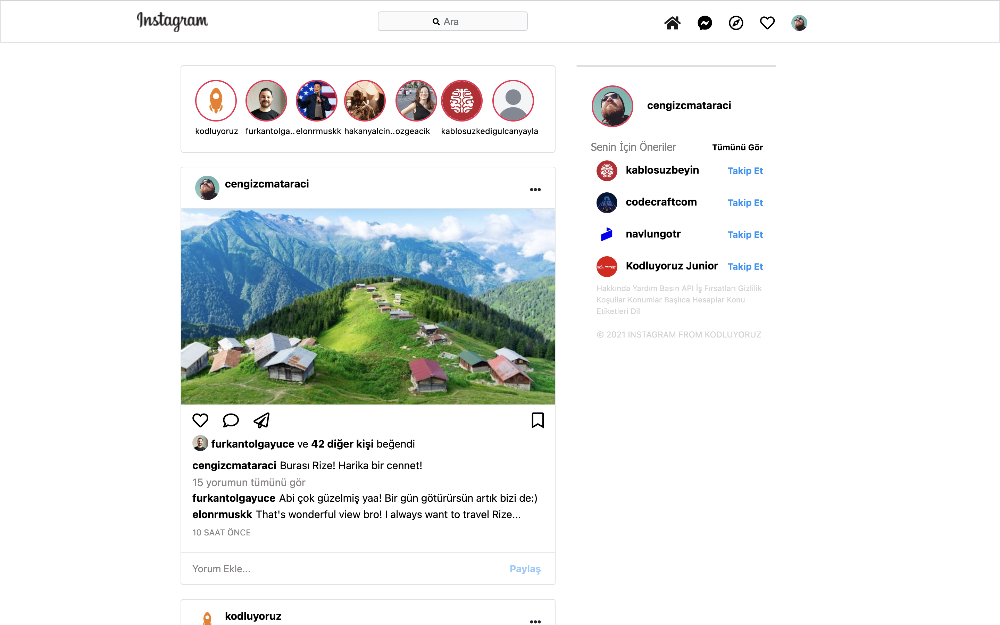

# Instagram Clone Project 📸

Bu proje, Instagram'ın temel özelliklerini ve tasarımını taklit eden bir HTML, CSS ve Bootstrap projesidir. Kullanıcılar, gönderi paylaşabilir, yorum yapabilir, beğenebilir ve önerilen hesapları takip edebilir. Bu projede kullanılan temel teknolojiler HTML, CSS ve Bootstrap'tir.

## Proje Özellikleri ✨
- **Kullanıcı Profili**: Profil fotoğrafı, kullanıcı adı ve beğeniler.
- **Paylaşımlar**: Fotoğraf paylaşımı, beğeni, yorum ve paylaşım simgeleri.
- **Yorumlar**: Gönderilere yapılan yorumlar.
- **Yorum Ekleme**: Kullanıcıların gönderilere yorum ekleyebilmesi.
- **Önerilen Hesaplar**: Takip etme önerileri.

## Kullanılan Teknolojiler 🛠️
- **HTML**: Yapı için.
- **CSS**: Stil ve tasarım için.
- **Bootstrap**: Tasarımı hızlandırmak için.
- **FontAwesome**: İkonlar için.

## Kurulum ⚡
1. Proje dosyasını bilgisayarınıza indirin.
2. HTML dosyasını bir tarayıcıda açın.
3. Projeyi yerel sunucunuzda çalıştırın veya doğrudan tarayıcınızda görüntüleyin.

## Proje Yapısı 📂
- **index.html**: Ana sayfa, profil ve paylaşımları içerir.
- **css/**: Projeye özel stil dosyaları.
- **images/**: Kullanıcı profilleri ve gönderi görselleri.
- **fonts/**: FontAwesome ikonları.

## Özellikler 📝
- Kullanıcılar, fotoğraf gönderisi paylaşabilir 📷.
- Gönderilere yorum yapabilir 📝.
- Beğeni, yorum ve paylaşım ikonları 💬❤️🔄.
- Önerilen hesaplar kısmında takip edilecek hesaplar önerilir 🔍.

## Ekran Görüntüleri 📸

## Katkıda Bulunma 🤝
Katkıda bulunmak isterseniz, lütfen bir pull request oluşturun. Herhangi bir sorunla karşılaşırsanız, lütfen bir issue açın.

## İletişim 📩
Eğer projeyle ilgili bir şeyler paylaşmak veya sorular sormak isterseniz, benimle iletişime geçebilirsiniz!

